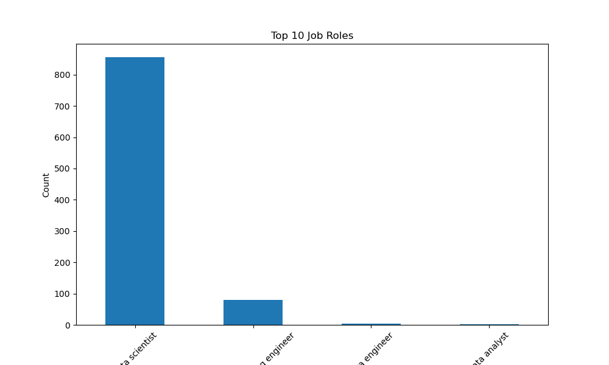
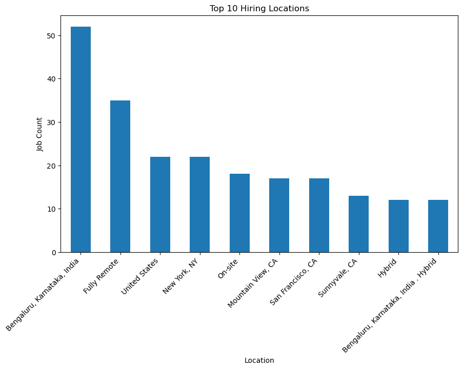
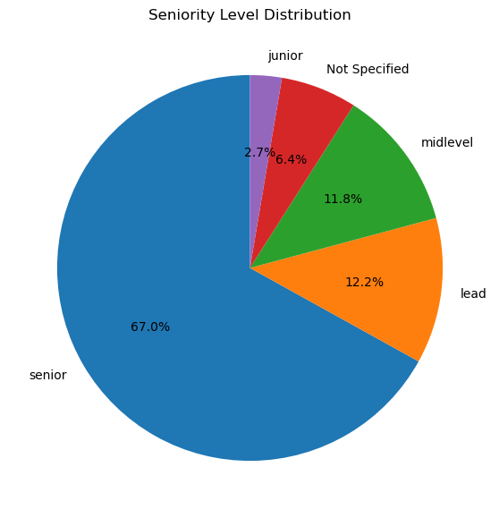
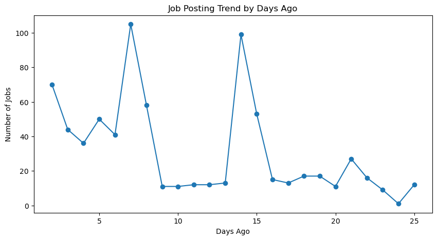
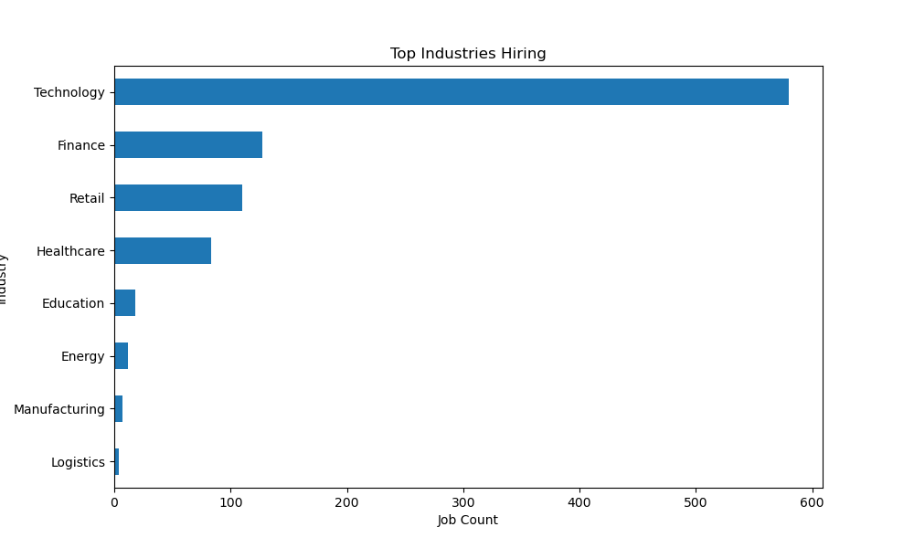

# Day 3 - Job Market Intelligence Dashboard 2025 

## Project Overview 

This project is part of my **31  Days Data Analytics & Data Science Challenge**.

In this Project, I analyzed real-world job market data using **Python, SQL, and Excel** to understand hiring trends, demanded skills,Job roles, industries, and  recruitment activity.

The main objective of this project was to build a **Job Market Intelligence Dashboard** that provides insights into the current hiring   landscape and market deamnds.  
 
---

# Tools & Technologies used   

- Python 
- Pandas
- Matplotlib
- Seaborn
- SQL
- MySQL
- Microsoft Excel
- Pivot Tables
- Pivot Charts
- Git & GitHub

---

# Project Workflow

1. Dataset Collection
2. Data Cleaning using Python
3. Feature Engineering
4. SQL Database Import
5. SQL KPI Analysis
6. Excel Pivot Tables
7. Excel Dashboard Creations 
8. Business Insights
9. GitHub Documentation

---

# KPIs Analyzed

- Total Job Postings
- Total Companies
- Recent Jobs
- Top Hiring Industries
- Top Job Roles
- Top Hiring Locations
- Seniority Level Distribution
- Hiring Activity Trend

---

# Analysis Performed

## Python Analysis

- Missing value handling
- Feature engineering
- Job trend analysis
- Industry analysis
- Hiring demand analysis
- Data visualization

---

## SQL Analysis

- Total job count
- Top hiring locations
- Top industries
- Top job roles
- Seniority analysis
- Recent hiring activity

---

## Excel Dashboards 

- KPI Cards
- Pivot Tables
- Pivot Charts
- Donut Charts
- Bar Charts
- Line Charts
- Business Insights Section

---

# Key Business Insights 

- Data Scientist roles dominate hiring demand.
- Technology industry leads recruitment activity.
- Bengaluru shows strong hiring opportunities.
- Hiring activity increased in recent postings.
- Seniority distribution shows high demand for experienced professionals.

---

# Python Charts & Visualizations

## Top Job Roles 



---

## Top Hiring Locations



---

## Seniority Distribution



---

## Hiring Activity Trend



---

## Top Hiring Industries



---

# Excel Dashboard Preview

## Job Market Intelligence Dashboard


---

# SQL Queries Included

- Total Job Postings
- Top Hiring Locations
- Top Job Roles
- Industry-wise Hiring
- Recent Job Activity
- Seniority Analysis

---

# Project Structure

```bash
Day3_Job_Market_Dashboard/
│
├── data/
├── cleaned_data/
├── charts/
├── notebook/
├── sql_queries/
├── excel_dashboard/
│   └── job_market_dashboard.xlsx
├── insights/
├── import_to_mysql.py
└── README.md


```
# Conclusion

This project helped me improve my practical understanding of:

Python Data Analysis
SQL Analytics
Excel Dashboarding
KPI Analysis
Hiring Trend Analysis
Business Intelligence
Data Visualization

Overall, this project strengthened my ability to combine Python, SQL, and Excel for real-world business analytics projects.

```
# Author

Gayatri chavhan
Python | SQL | Excel | Data Analytics
